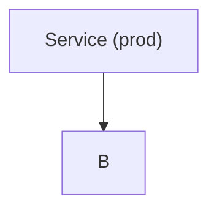
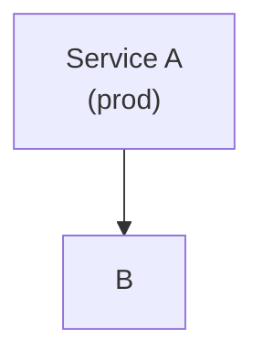

# Notion-flavored Markdown 陷阱清單

**這份只列「看起來對但會出錯」的陷阱**，不重現 spec。完整語法讀 `notion://docs/enhanced-markdown-spec`。

## 縮排與空白

### ❌ 用空格縮排
Notion 的 parser 用 **tab** 判定 block 層級。空格縮排會被當成普通文字。

### ❌ 手動插 `<empty-block/>` 製造空行
Notion 自動處理 block 間距。亂插 empty-block 會出現奇怪的空隙。**只在**真的需要一個明確空行且該位置沒別的 block 時才用，且必須**獨佔一行**。

### ❌ 單獨一個 `>` 製造空 quote
會渲染成空的 blockquote。省掉，或寫進真實內容。

## Headings

### ❌ 用 H5 / H6
Notion 不支援，會自動降級為 H4。結構設計時就**不要超過 4 層**，再深就該拆頁或改用其他結構。

## List

### ❌ 空 bullet
```
- 
- 有內容的項目
```
第一個空 bullet 在 Notion UI 會顯示一個孤零零的空圓點。刪掉或填內容。

### ❌ List 項目直接放 non-rich-text child
```
- 
    > 這是 quote
```
預期是「這個 bullet 下面有一段 quote」，但因為 bullet 本身沒 rich text，會變成空 bullet + 獨立 quote。先給 bullet 一句話當 header。

## Quotes

### ❌ 多行 quote 用 newlines
```
> 第一行
> 第二行
> 第三行
```
↑ 渲染成**三個**獨立 quote blocks，不是一個三行的 quote。

✅ 用 `<br>` 連接：
```
> 第一行<br>第二行<br>第三行
```

## Code blocks

### ❌ 轉義特殊字元
```js
const arr = \[1, 2, 3\]
const re = /\\d+/
```
Notion 程式碼區塊內**不套用**反斜線轉義規則，`\` 是字面值。結果會是 `\[1, 2, 3\]`、`\\d+`，不是你想的。

✅ 照原樣寫：
```js
const arr = [1, 2, 3]
const re = /\d+/
```

### ❌ Mermaid 節點文字含 `()` 沒用雙引號
```mermaid
flowchart
    A[Service (prod)] --> B
```
parser 會吃掉括號或報錯。

✅ 雙引號包起來：


### ❌ Mermaid 換行用 `\n`
`\n` 在 mermaid label 裡不是換行符。

✅ 用 `<br>`：


## Inline math

### ❌ `$` 周圍空白錯位
```
這是 $ x + y $ 的計算      ← $ 內側有空白
這是$x + y$的計算          ← $ 外側沒空白
```
都不會渲染成 math。

✅ `$` **外側要有空白**、**內側不能有空白**：
```
這是 $x + y$ 的計算
```

結尾 `$` 同理：前面（內側）不能有空白、後面（外側）要有。

## Table

### ❌ Cell 裡塞 heading / list / image
```
<tr><td>## 重點</td><td>- 項目 1</td></tr>
```
Table cell **只能**放 rich text。heading、list、image、code block 都不支援。

✅ 要用粗體強調就 `**重點**`，要用「項目感」就寫成「項目1, 項目2, 項目3」或乾脆拆成多列。

### ❌ Cell 裡用 HTML 寫格式
```
<td><strong>重點</strong></td>
```
Cell 內必須用 markdown，不是 HTML。

✅ `<td>**重點**</td>`

## Callout

### ❌ Callout 內用 HTML 寫格式
```
<callout>這是<strong>重點</strong></callout>
```
✅ `<callout>這是**重點**</callout>`

### ❌ 把一整個 blockquote 結構塞進 callout inline
Callout 可以包**多個 child block**，但每個 child 都要縮排（tab）到 callout 內：
```
<callout icon="💡">
	這是 callout 的主文
	- 可以有子 bullet
	- 也可以
	```python
	# 甚至 code block
	```
</callout>
```

## `<page>` vs `<mention-page>`

這是最容易出嚴重錯誤的陷阱。

### ❌ 想「引用」既有頁面卻用 `<page>` tag
```
相關背景：<page url="https://notion.so/existing-page">既有頁面</page>
```
這段 markdown 送進 `notion-update-page` 的後果：
1. 「既有頁面」會被**搬進**當前頁成為子頁
2. 從原位置**消失**
3. 如果用 `replace_content` 且沒保留這個 tag，**子頁被刪除**

✅ 要引用用 `<mention-page>`：
```
相關背景：<mention-page url="https://notion.so/existing-page"/>
```

### ❌ Update 頁面時忘了保留現有子頁的 `<page>` tag
用 `replace_content` 時，任何你 new_str 裡沒提到的子頁會被刪掉（API 會先擋下來要你確認）。先 fetch 當前 content，把 `<page url="...">` 原樣放回 new_str 裡。

## Database embedding

### ❌ 把 `database_id` 當 `page_id` 傳
`notion-create-pages` 的 parent：
- 普通頁：`{"type": "page_id", "page_id": "..."}`
- DB 單源：`{"type": "database_id", "database_id": "..."}` ✅ （但多源會被拒絕）
- DB 多源：`{"type": "data_source_id", "data_source_id": "..."}` ✅
- Wiki DB：必須用 `page_id`（wiki 的 page URL），**不能**用 `data_source_id`

### ❌ `<database>` tag 想要嵌入，結果塞了既有 DB URL
```
<database url="https://notion.so/existing-db">既有 DB</database>
```
這會把 DB **搬進**當前頁（跟 `<page>` 一樣）。

✅ 要當 inline view 用 `data-source-url`：
```
<database data-source-url="collection://..." inline="true">既有 DB view</database>
```

✅ 要純引用用 `<mention-database>`。

## Media src URL

### ❌ 用 `{{完整 URL}}` 格式
```
<video src="{{https://example.com/video.mp4}}">caption</video>
```
不支援。`{{...}}` 是給壓縮 URL ID 用的（`{{1}}`、`{{2}}`）。

✅ 兩種形式：
```
<video src="https://example.com/video.mp4">caption</video>
<video src="{{1}}">caption</video>
```

## Meeting notes

### ❌ 建立 meeting notes 時塞 `<summary>` 或 `<transcript>`
這兩個是 AI 生成與原始錄音產出，建立時**必須省略**，不然會報錯。只有 `<notes>`（且只在用戶明確要你寫筆記時）可以給。

```
<meeting-notes>
	Q2 規劃會議
	<notes>
		... 會議筆記 ...
	</notes>
</meeting-notes>
```

## Synced block

### ❌ 建立 synced block 時給 `url`
建立新 synced block **不要** `url`，API 會自動產。給 url 是用在 `<synced_block_reference>`，引用既有 synced block。

```
<synced_block>
	共享區塊內容
</synced_block>
```

## 寫入 DB property 的特殊格式

### ❌ Date property 寫成 ISO 字串
```json
{"Due Date": "2026-04-20"}
```
Date 是**展開**成三個 key 的：
```json
{
  "date:Due Date:start": "2026-04-20",
  "date:Due Date:is_datetime": 0
}
```

### ❌ Checkbox 用 true/false
```json
{"Done": true}
```
必須是字串：
```json
{"Done": "__YES__"}
```

### ❌ Property 名 `URL`/`id` 直接寫
```json
{"URL": "https://..."}
```
名稱是 `id` 或 `url`（不分大小寫）→ 前綴 `userDefined:`：
```json
{"userDefined:URL": "https://..."}
```

### ❌ 猜 property 名稱
**每次**寫入 DB 都要先 `notion-fetch` 拿 schema。DB 名稱可能和你記得的不一樣，多源 DB 還可能有多組 schema。

## Escape 字元

需要轉義（外部 markdown context）：`\ * ~ ` $ [ ] < > { } | ^`

**不要**在 code block 裡轉義——裡面一律字面值。

## 「inline math 渲染不出來」的常見原因

1. `$` 內側有空白
2. `$` 外側**沒有**空白
3. 表達式內含 `$` 沒 escape
4. 在 table cell 裡（table cell 的 rich text 對 math 支援有限）
5. 誤用 `$$...$$`（那是 block equation 不是 inline）

## 想偷懶的反模式

### ❌ 把一堆不同性質的東西塞同一個 paragraph
讀起來像一坨牆，Notion 的 hover copy-link、comment、mention 都無法精準落點。**一個想法一個 block**。

### ❌ 用 `---` 代替 heading
divider 是視覺分段，不是結構分段。搜尋/目錄/navigation 抓不到 divider，抓得到 heading。
