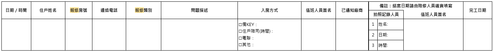
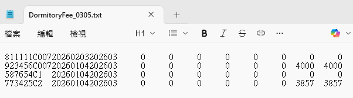
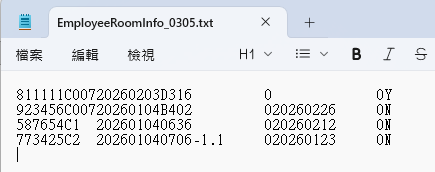

# 壹、版本說明

---

| 修改日期 | 需求編號 | 修改項目 |
| --- | --- | --- |
| 2026-03-24 | - | 發布版本v0.1 |
| 2026-03-27 | - | 發布版本v0.2 |

# 貳、需求大綱

- 【R0044】點檢作業功能（宿舍管理後台／清潔派工系統／宿舍管家系統）
- 【R0050】報修作業功能（宿舍管理後台／清潔派工系統／宿舍管家系統）
- 【R0051】扣款參數維護（宿舍管理後台）
- 【R0052】扣款項目計算（宿舍管理後台）
- 【R0053】備品參數維護（宿舍管理後台）
- 【R0054】備品管理功能（宿舍管理後台／清潔派工系統）
- 【R0056】寢具送洗管理功能（宿舍管理後台／清潔派工系統）
- 【R0058】單身有眷申請（宿舍管理後台／宿舍預約系統）
- 【R0060】宿舍管家系統登入 QRcode 製作需求

# 參、需求內容

## 【R0044】點檢作業功能（宿舍管理後台／清潔派工系統／宿舍管家系統）

### 一、需求說明

1. 本需求旨在建立宿舍點檢作業之數位化流程，提供線上 check-In/Check-Out 點檢表填寫與查詢功能，作為獨立表單作業，不需與訂退房系統強制綁定。
2. 系統須提供不同角色使用之點檢表單，區分「員工（住戶）」與「櫃檯／駐廠人員」兩種表單格式與專業程度。未來也可能新增其他種類點檢表。
3. 點檢表須依據以下維度進行差異化設計：
    i. 員工職級（如一般員工、VIP等）
    ii. 訂房路徑：
        - 一般訂房（國內）：因公住宿，提供完整寢具及日用備品，無須自備。
        - 一般訂房（國外）：因公住宿，除標準備品外，另提供額外生活用品，以利外籍員工快速安頓。
        - 單身訂房：不提供寢具（棉被、枕頭），由住戶自行準備，屬長期租用性質。
        - 有眷訂房：不提供寢具（棉被、枕頭），由住戶自行準備，屬長期租用性質。
    iii. 廠別（如美國廠、中科等）
    iv. 宿舍別（不同宿舍有不同點檢表）
    v. 系統須支援上述維度之組合條件對應，例如：美國廠的VIP職級，用一般訂房路徑入住中科A宿舍，應能對應至正確的點檢表。
4. 點檢過程中若發現設備異常或損壞，使用者可於表單中直接勾選異常項目，系統須自動導入後續報修流程（詳見【R0050】報修作業功能）。
5. 當員工完成退房後，系統須自動建立點檢待辦事項（To-Do），並可指派相關人員進行現場檢查。
6. 點檢通過的流程：
    i. 台積電員工退房後會由櫃檯人員「執行點檢」，點檢完畢後，才會執行「派工清潔」
    ii. 清潔人員收到「派工清潔」指示，進房間進行清潔打掃，打掃完回報「清潔完成」
    iii. 至下一次台積電員工要入住時，櫃檯人員進房「執行點檢」，點檢完畢後，這間房間會變成準備好的狀態，可供台積電員工入住
7. 點檢不通過的流程：
    i. 現況若項目點檢不通過，均走報修單。
        - 舉例：床包未配備→建立報修單→通知櫃檯人員補發，或由台積電員工（住戶）至櫃檯領取
        - 舉例：對講機故障→建立報修單

<table>
  <tr>
    <td align="center">員工點檢表（一般／中文）<br></td>
    <td align="center">員工點檢表（一般／英文）<br></td>
  </tr>
  <tr>
    <td align="center">員工點檢表（有眷／中文）<br></td>
    <td align="center">員工點檢表（有眷／英文）<br></td>
  </tr>
  <tr>
    <td align="center">TUD退房內物品點檢表（英文）<br></td>
    <td></td>
  </tr>
</table>

### 二、使用情境

1. 櫃檯／駐廠人員：於住戶「入住前」及「退房後」，攜帶手機或平板至宿舍現場執行專業點檢，確認房間狀態與設備損壞責任。
    i. 退房後點檢之主要目的為確認有無設備損壞。
    ii. 接收到下一個排房資訊後，執行入住前點檢，重複上述作業流程。
2. 台積電員工（住戶）：於「入住後」透過系統自行點檢確認房內設備狀況，並於「退房前」再次執行自主點檢，以完成交屋確認。
3. 管理員（後台稽核）：於宿舍管理後台檢視員工提交之點檢結果，統整損壞狀況並進行後續處理。
4. 台積電員工（住戶）：於點檢過程中發現設備異常，提出報修申請→櫃檯人員接收並判定委派廠商→櫃檯人員追蹤維修進度與費用歸屬→維修完成→台積電員工（住戶）收到報修完成通知（詳見【R0050】報修作業功能）。

### 三、功能需求

1. 點檢表單管理
    i. 系統須提供 In/Out 點檢表之建立、填寫與查詢功能。
    ii. 系統須支援不同角色之點檢表單顯示差異（員工版／櫃檯版）。
    iii. 系統須支援依員工職級、訂房路徑、廠別及宿舍別等多維度條件，自動對應適用之點檢表單。
2. 異常與報修處理
    i. 使用者於點檢表中勾選異常項目後，系統須可建立對應報修紀錄。
    ii. 系統須支援後續維修流程串接，如報修單建立與狀態追蹤（詳見【R0050】報修作業功能）。
3. 點檢待辦機制
    i. 員工完成退房後，系統須自動產生點檢待辦事項。
    ii. 系統須支援待辦事項指派及狀態管理（未處理／處理中／完成）。
4. 多系統整合
    i. 宿舍管家系統：提供員工自主點檢填寫功能。
    ii. 清潔派工系統：提供櫃檯／駐廠人員現場點檢操作。
    iii. 宿舍管理後台：提供點檢結果查詢、稽核與管理功能。

### 四、非功能需求

1. 系統須支援行動裝置（手機、平板）操作，確保現場點檢作業順暢。
2. 點檢資料須完整保存，並具備查詢與追溯能力。
3. 系統須確保不同角色僅可存取對應權限之點檢資料。

### 五、驗收條件

1. AC-01：當台積電員工（住戶）已登入宿舍管家系統並進入點檢功能頁面，填寫完整點檢表單後按下送出，系統須成功儲存該筆點檢紀錄並顯示送出成功訊息。
2. AC-02：當櫃檯人員或駐廠人員以行動裝置（手機或平板）登入清潔派工系統，選擇指定房間並執行現場點檢，系統須正確載入對應點檢表單並支援逐項填寫與送出。
3. AC-03：當不同維度條件（員工職級、訂房路徑、廠別、宿舍別）之組合輸入後，系統須自動對應並顯示正確的點檢表單，不同組合不得出現錯誤對應。
4. AC-04：當使用者於點檢表中勾選一項以上異常項目並送出，系統須自動建立對應之報修紀錄，並可於報修清單中查詢該筆紀錄。
5. AC-05：當台積電員工（住戶）完成退房作業後，系統須自動產生一筆點檢待辦事項，並顯示於待辦清單中，狀態為「未處理」。
6. AC-06：當管理員登入宿舍管理後台，進入點檢查詢功能，系統須可依條件篩選並顯示點檢結果與對應待辦事項。
7. AC-07：當櫃檯人員尚未接收到排房資訊時，系統不得開放該房間之入住前點檢功能；接收排房資訊後，系統須開放並允許執行入住前點檢。
8. AC-08：當點檢項目未通過時，系統須引導使用者建立報修單，且報修紀錄須與該點檢紀錄關聯。

### 六、待釐清項目

（無）

---

## 【R0050】報修作業功能（宿舍管理後台／清潔派工系統／宿舍管家系統）

### 一、需求說明

1. 本需求旨在建立完整之宿舍報修作業流程，涵蓋報修申請、派工處理、修繕執行及結案紀錄，以提升維修效率並確保流程可追蹤。
2. 報修作業橫跨宿舍管理後台、清潔派工系統及宿舍管家系統三套子系統，各角色依權限於對應系統中執行作業。
3. 本需求適用角色包含台積電員工（住戶）、櫃檯人員、排房人員、清潔人員及承辦人員。
4. 修繕完成後之費用由責任歸屬方承擔（台積電員工、台積電管理方或房東），費用不從員工薪資扣款，可能請員工自行付費給廠商或自行補回損壞物品。
5. 員工與櫃檯人員使用相同之報修表單進行申請，本期不需支援照片上傳。
6. 報修對排房作業之影響分為兩種情境：
   i. 需修繕完成才可排房。
   ii. 尚未修繕但仍可排房。
7. 排房作業需即時掌握房間報修狀態與可排房標示，以避免影響排房效率。

### 二、使用情境

1. 台積電員工（需陪同）：員工於宿舍管家系統提出報修申請並確認可配合之修繕時間，由櫃檯人員與員工共同陪同廠商進房修繕。
2. 台積電員工（不需陪同）：員工授權櫃檯人員使用備用鑰匙進入房間，由櫃檯人員陪同廠商完成修繕，員工無需在場。
3. 櫃檯人員：接收報修申請後，判斷案件內容並進行派工，並於修繕完成後更新狀態與相關紀錄。
4. 櫃檯人員／清潔人員：於入住前或退房後執行點檢作業時（詳見【R0044】點檢作業功能），發現有項目需報修，由櫃檯人員或清潔人員自行提出報修申請。
5. 承辦人員：承辦人員於宿舍現場作業時發現設備損壞，或接獲台積電員工（住戶）反映設備異常，通知櫃檯人員協助提出報修申請。承辦人員亦可依實際情況，手動調整報修房間之可排房標示。
6. 排房人員：依系統中房間之報修狀態與可排房標示，判斷該房間是否可進行排房作業。排房人員亦可手動調整可排房標示。排房人員執行此操作時位於內網環境。

### 三、功能需求

1. 報修申請與表單
   i. 系統須提供統一報修表單，供台積電員工（住戶）與櫃檯人員填寫（報修表單參考圖片詳見本節末）。
   ii. 報修表單須包含以下欄位：
      - 日期／時間：系統自動帶入申請時間，使用者可手動調整。
      - 住戶姓名：台積電員工（住戶）自行報修時，系統自動帶入登入者姓名，不可手動修改；櫃檯人員代報時，系統依據該時段居住人員進行預帶，可手動調整。
      - 報修房號：台積電員工（住戶）自行報修時，系統自動帶入其入住房號，不允許報修非自己的房間；櫃檯人員代報時，系統依據該時段居住人員進行預帶，可手動調整。
      - 連絡電話：系統自動帶入員工登記之聯絡電話，不可編輯。若需修改聯絡電話，須由承辦人員或對應權限人員於宿舍管理後台編輯。
      - 報修類別：以下拉選單方式選擇（選項清單待與客戶確認）。
      - 問題描述：文字描述欄位（是否必填及字數限制待與客戶確認）。
      - 入房方式：提供選項包含備KEY、住戶陪同、電聯、其他（單選或複選及各選項附加欄位待與客戶確認）。
      - 已通知廠商：僅提供「已通知／未通知」勾選。
   iii. 系統須於送出報修申請後建立案件資料，案件初始狀態為「待處理」，並自動記錄受理之操作人員帳號，供後續追蹤與處理。
   iv. 本期報修表單不需支援照片上傳功能，亦不保留拍照記錄人員欄位。

2. 派工與處理流程
   i. 系統須提供櫃檯人員於清潔派工系統中檢視報修申請並執行派工處理之功能。
   ii. 系統須支援修繕時間安排與回報。
   iii. 系統與廠商通知流程無資料連動，廠商聯繫由櫃檯人員於線下執行，修繕完畢後由櫃檯人員手動更新系統狀態。

3. 維修狀態管理
   i. 系統須提供案件狀態管理機制，包含以下狀態：待處理、已派工／備料中、已結案。
   ii. 系統須即時更新並顯示案件處理進度。
   iii. 系統須支援標示報修房間是否可排房（「需修繕完成才可排房」或「尚未修繕但仍可排房」），此標示由櫃檯人員、承辦人員或排房人員手動調整。
   iv. 系統接收報修資訊後，須即時將報修狀態回傳至宿舍管理後台之排房功能。排房人員於房間列表中以標記圖示方式檢視該房間是否有報修，排房人員重新整理畫面後即可看到最新狀態。
   v. 排房功能須提供篩選機制，支援依報修狀態或可排房標示篩選房間（如僅顯示可排房之房間、排除報修中之房間），以提升排房作業效率。
   vi. 系統須記錄狀態異動資訊（含異動時間與操作人員），以利後續追蹤案件處理歷程。

4. 修繕紀錄與結案
   i. 系統須記錄修繕結果及完工日期（系統自動帶入結案時間，可手動調整）。
   ii. 系統須於結案時自動記錄結案操作人員帳號。
   iii. 系統須於案件結案後保存完整歷程紀錄。

5. 費用與責任歸屬
   i. 系統須支援修繕費用紀錄，費用以新臺幣計，金額無上限，以單一金額欄位填寫（不區分含稅與否）。
   ii. 系統須記錄責任歸屬（台積電員工／台積電管理方／房東）。
   iii. 系統僅記錄費用與責任歸屬，不處理員工薪資扣款。

6. 多系統整合
   i. 宿舍管家系統：提供台積電員工（住戶）報修申請與查詢功能。
   ii. 清潔派工系統：提供櫃檯人員派工與現場處理操作。
   iii. 宿舍管理後台：提供報修案件查詢、管理與統整功能。

7. 報修表單參考圖片

   

### 四、非功能需求

1. 系統須支援行動裝置操作，確保現場修繕流程順暢。
2. 報修資料須完整保存，並具備查詢與追溯能力。
3. 系統須確保不同角色僅可存取對應權限之報修資料。
4. 房間報修狀態更新後，排房相關畫面須能即時反映。

### 五、驗收條件

1. AC-01：台積電員工（住戶）提交報修申請
   i. 前置條件：台積電員工（住戶）已登入宿舍管家系統。
   ii. 操作步驟：填寫報修表單並送出申請。
   iii. 預期結果：系統成功建立報修案件，案件狀態顯示為「待處理」。

2. AC-02：員工與櫃檯人員使用相同報修表單
   i. 前置條件：員工或櫃檯人員進入報修申請頁面。
   ii. 操作步驟：檢視報修表單欄位。
   iii. 預期結果：兩種角色使用之報修表單欄位一致。

3. AC-03：櫃檯人員檢視報修案件並執行派工
   i. 前置條件：系統已存在待處理之報修案件。
   ii. 操作步驟：櫃檯人員於清潔派工系統接收報修資訊，檢視案件內容並執行派工。
   iii. 預期結果：案件狀態即時更新為「已派工／備料中」，系統記錄狀態異動歷程（含異動時間與操作人員）。

4. AC-04：修繕結案
   i. 前置條件：修繕作業已完成。
   ii. 操作步驟：櫃檯人員於系統中手動更新修繕結果並執行結案操作。
   iii. 預期結果：案件狀態更新為「已結案」，系統保存完整歷程紀錄。系統不自動發送通知予廠商。

5. AC-05：記錄修繕費用與責任歸屬
   i. 前置條件：報修案件進行結案。
   ii. 操作步驟：櫃檯人員填寫修繕費用（新臺幣金額）並選擇責任歸屬（台積電員工／台積電管理方／房東）。
   iii. 預期結果：系統成功記錄費用金額與責任歸屬。

6. AC-06：台積電員工（住戶）查詢報修進度
   i. 前置條件：台積電員工（住戶）已提交報修申請。
   ii. 操作步驟：員工於宿舍管家系統查詢報修案件。
   iii. 預期結果：系統顯示該案件之最新處理進度與狀態。

7. AC-07：手動調整報修房間之可排房標示
   i. 前置條件：某房間已建立報修案件。
   ii. 操作步驟：櫃檯人員、承辦人員或排房人員於系統中手動調整該房間之可排房標示（「需修繕完成才可排房」或「尚未修繕但仍可排房」）。
   iii. 預期結果：系統成功更新可排房標示，並記錄調整時間與操作人員。

8. AC-08：排房人員檢視房間報修標記
   i. 前置條件：某房間已建立報修案件。
   ii. 操作步驟：排房人員於宿舍管理後台之排房功能檢視房間列表，並重新整理畫面。
   iii. 預期結果：該房間以標記圖示顯示有報修，並顯示可排房標示。

9. AC-09：排房功能篩選報修房間
   i. 前置條件：系統中存在多個房間，部分房間有報修案件。
   ii. 操作步驟：排房人員於排房功能中使用篩選機制（如僅顯示可排房之房間、排除報修中之房間）。
   iii. 預期結果：系統依篩選條件正確過濾房間列表，僅顯示符合條件之房間。

10. AC-10：報修表單不含照片上傳功能
    i. 前置條件：員工或櫃檯人員進入報修表單頁面。
    ii. 操作步驟：檢視報修表單欄位。
    iii. 預期結果：表單不包含照片上傳欄位及拍照記錄人員欄位。

### 六、待釐清項目

1. 報修類別下拉選項清單：系統化後報修類別須以下拉選單方式選擇，但具體選項清單（如水電、門鎖、家具、空調、衛浴、網路、其他等）須由客戶提供或確認。若包含「其他」選項，是否允許使用者自行輸入補充說明。
2. 問題描述欄位規格：問題描述是否為必填欄位，以及是否設定字數限制。
3. 入房方式欄位操作方式：入房方式選項（備KEY、住戶陪同、電聯、其他）為單選或複選。選擇「住戶陪同」時是否須另填可配合時間；選擇「電聯」時是否須另填聯絡資訊；選擇「其他」時是否須填寫說明。

---

## 【R0051】扣款參數維護（宿舍管理後台）

### 一、需求說明

宿舍管理後台須提供扣款參數之維護功能，供承辦人員於執行每月扣款作業前，建立並管理各項費用之基礎資料、計費方式與分攤邏輯。本需求涵蓋扣款項目類別之定義、房間帳單參數之建立，以及各項費用之分攤規則設定。實際扣款金額之計算邏輯，詳見【R0052】扣款項目計算。

1. **扣款項目類別**

    本系統支援之扣款項目類別如下（項目類別尚需與各區域承辦人員確認）：

    i. **月租金**：單身宿舍與有眷宿舍均適用。每間房間設定不同之月租金金額，以日為計費單位，依據住戶之實際住宿期間計算費用。
    ii. **保證金**：僅適用於有眷自費住宿，單身自費住宿無保證金。每間房間設定不同之保證金金額。同一房間若有兩張床位，保證金依實際使用床位數按比例收取。
        - 兩人入住時，每人收取房間保證金之半額（例如：房間保證金為 6,000 元，每人收取 3,000 元）。
        - 若為主管房或住戶申請單人使用整間房間，則收取全額保證金。
        - 入住之第一個月收取全額保證金；退房後之次月退還全額保證金。
        - 範例：住戶於 6 月入住，6 月收取保證金全額；7 月期間退房，則於 9 月退還保證金。
        - 上述保證金收取比例規則同樣適用於月租金之計算。
    iii. **水費**：依據每間房間對應之水錶錶號，於單月或雙月收到帳單時，依住戶之住宿期間及房間住宿人數，進行錶號費用之分攤計算。
    iv. **電費**：依據每間房間對應之電錶錶號，於單月或雙月收到帳單時，依住戶之住宿期間及房間住宿人數，進行錶號費用之分攤計算。
    v. **瓦斯費**：依據每間房間對應之瓦斯錶錶號，於單月或雙月收到帳單時，依住戶之住宿期間及房間住宿人數，進行錶號費用之分攤計算。
    vi. **電話費**：依據房間綁定之市內電話號碼，於帳單到達時，比對住宿期間內之住戶資料進行費用分攤。帳單可依「電話號碼 + 費用金額」或「工號 + 費用金額」兩種格式對應，帳單資料之匯入與計算流程詳見【R0052】扣款項目計算。
        - 以電話號碼對應時，系統依住宿天數比例分攤費用至對應住戶。
        - 以工號對應時，系統將費用全額歸屬該住戶。
    vii. **設備費**：如電視、冰箱、冷氣等設備之租金，每間房間設定一筆固定金額，以日為計費單位。
        - 範例：住戶於某月實際入住 501 號房共 10 天，設備費月租 600 元，則該月設備費 =（10 ÷ 30）× 600 = 200 元。
    viii. **停車費**：適用於嘉義宿舍。車位數量有限，以抽籤方式分配。
        - 車位設定每月租金，以日為計費單位。
        - 車位使用期間與住宿期間不一定一致，住戶可能於入住一段時間後方獲分配車位。
        - 排房人員或櫃檯人員均可執行車位分配作業。
    ix. **其他費用**：其他未歸類之費用項目。

2. **帳單參數**

    i. 須建立每間房間對應之水錶錶號、電錶錶號與瓦斯錶錶號。
    ii. 須設定各項費用之分攤邏輯，例如：瓦斯費之基本費由公司與住戶共同負擔，天然氣使用費由住戶全額負擔。
    iii. 統一設定帳單拆分規則：基本費（公司 + 住戶分攤）、流動費（住戶全額負擔）。

**附件：帳單格式參考**（帳單匯入功能詳見【R0052】扣款項目計算）

- 瓦斯費帳單

    

- 電費帳單

    | 電費匯入資料格式（現行 Excel 格式） | 台電繳費憑證 |
    |:---:|:---:|
    |  |  |

### 二、使用情境

1. **建立扣款項目與分攤方式**：承辦人員進入宿舍管理後台，定義扣款項目類別（如月租金、水費、電費、瓦斯費、設備費等），並設定各項目之計費方式。例如，將設備費設定為「依個人（固定金額）」每月 600 元，而電費設定為「依房間（依帳單分攤）」。
2. **維護房間帳單參數**：承辦人員為每間房間建立對應之水錶錶號、電錶錶號與瓦斯錶錶號，確保帳單到達時可正確對應至房間。
3. **設定費用拆分邏輯**：承辦人員設定各帳單費用之拆分規則，例如電費之「基本費」由公司與住戶共同負擔，「流動電費（使用費）」由住戶全額負擔。
4. **維護車位參數**：排房人員或櫃檯人員設定車位之每月租金，並將車位分配給住戶。
5. **調整參數設定**：當費率變動或房間設備異動時，承辦人員進入系統更新對應之參數資料。

### 三、功能需求

> ⚠️ 待 SA 確認後補完。以下為依業務脈絡初步整理之功能需求草稿，須經確認後定版。

1. **扣款項目類別管理**
    i. 系統須提供扣款項目類別之新增、修改、停用功能，項目類別包含：月租金、保證金、水費、電費、瓦斯費、電話費、設備費、停車費及其他費用。
    ii. 系統須支援為每項扣款項目設定計費方式（如：固定金額、依帳單分攤）。
    iii. 系統須支援為每項扣款項目設定計費單位（如：以日計費、以月計費）。
2. **房間參數維護**
    i. 系統須支援為每間房間設定月租金金額。
    ii. 系統須支援為每間房間設定保證金金額。
    iii. 系統須支援為每間房間建立對應之水錶錶號、電錶錶號與瓦斯錶錶號。
    iv. 系統須支援為每間房間設定設備費金額。
    v. 系統須支援為每間房間綁定市內電話號碼。
3. **費用分攤規則設定**
    i. 系統須支援為水費、電費、瓦斯費設定帳單拆分規則，區分「基本費」與「流動費（使用費）」之分攤對象（公司負擔或住戶負擔）。
    ii. 系統須支援設定保證金之收取與退還規則。
4. **車位參數維護**
    i. 系統須支援車位之每月租金設定，以日為計費單位。
    ii. 系統須支援將車位分配給住戶，且車位使用期間可獨立於住宿期間設定。
    iii. 系統須支援排房人員與櫃檯人員均可執行車位分配作業。

### 四、非功能需求

> ⚠️ 待 SA 確認後補完。

（暫無）

### 五、驗收條件

> ⚠️ 待 SA 補完三、四後，PM 後補驗收條件。

（暫無）

### 六、待釐清項目

1. 扣款項目類別之完整清單，須與各區域承辦人員確認是否有遺漏或調整。
2. 保證金之收取規則：當同房間兩位住戶之入住與退房時間不同步時，保證金金額如何調整（例如：原兩人入住各收 3,000 元，其中一人退房後，另一人之保證金是否需調整為 6,000 元）。
3. 停車費之車位分配流程確認：目前規劃為「住戶自行於系統點選申請 → 依先來後到排隊 → 先到先得」，此流程是否正確？另外，住戶排隊取得車位後，系統詢問是否確定保留該車位，確認保留後是否還有後續流程（如簽約、押金繳納等）？
4. 三、功能需求及四、非功能需求待 SA 確認後定版；五、驗收條件待 PM 補完。

---

## 【R0052】扣款項目計算（宿舍管理後台）

### 一、需求說明

本功能為宿舍管理後台之扣款計算核心，負責依據詳見【R0051】扣款參數維護所建立之費用參數，執行每月住宿費用之試算、資料過濾、紀錄合併，以及產出供台積電薪資系統讀取之標準檔案。

1. **業務背景**
    i. 每月結算時，系統須根據住戶之實際入住天數、房間帳單資料及分攤規則，自動計算各項住宿費用。
    ii. 計算完成後，系統須產出兩份文字檔（DormitoryFee.txt 與 EmployeeRoomInfo.txt），供薪資系統自動讀取並執行薪資扣款。
    iii. 因薪資系統僅處理台灣員工扣款，且要求「一人一號一筆」之讀取格式，系統須於產出檔案前進行資料過濾與合併。
2. **核心計算公式**
    i. **租金與固定費用**：採 `(實際入住天數 / 計費月份天數) × 月租金` 計算。
    ii. **水電瓦斯（浮動費用）**：依「扣款區間總天數」換算至每日金額，再依據每日房內實際入住人數進行分攤。退房日當天不計價（例如 9/30 退房，計費僅算至 9/29）。
3. **兩階段作業流程**
    i. **第一階段（Excel 核對）**：系統先產出 Excel 檔案，供承辦人員進行金額檢核與局部微調。
    ii. **第二階段（產出文字檔）**：承辦人員校正完畢後，將 Excel 回傳至系統，由系統自動轉譯產出符合規範之文字檔，避免人工編輯文字檔導致格式錯誤。
4. **匯出檔案組成**
    i. **DormitoryFee.txt（Fee 檔）**：記錄工號、宿舍代碼、計費年月、各項費用細目（水、電、瓦斯、租金等）及總計金額。
    ii. **EmployeeRoomInfo.txt（Info 檔）**：記錄工號、宿舍代碼、起租日期、退租日期、房號及住宿註記，作為薪資系統之比對資料。

- Fee 檔範例

    

- Info 檔範例

    

### 二、使用情境

1. **承辦人員執行每月費用試算**
    i. 承辦人員於每月結算日，針對住宿名單執行費用試算。
    ii. 租金計算範例：王小明 4/21 入住、4/30 退房，實際入住 9 天（退房日當天不計價）。租金公式為：`(9天 / 30天) × 月租金 3,000元 = 900元`。
    iii. 水電瓦斯分攤範例：承辦人員輸入該期水費帳單 360 元（扣款區間 30 天），系統自動換算每日水費為 12 元。若某房間前 5 天住 A、B 共 2 人、第 6 天起 C 入住變為 3 人，系統依據每日房內實際入住人數計算每人每日分攤金額，再乘以該人數下之天數累加。例如 A 的水費為 `(12÷2)×5 + (12÷3)×25 = 30 + 100 = 130 元`，C 的水費為 `(12÷3)×25 = 100 元`。
2. **承辦人員執行 Excel 核對與微調**
    i. 承辦人員從後台導出 Excel 格式之原始扣款清單（版本 V）。
    ii. 承辦人員在 Excel 中檢視金額，若發現某位員工因特殊專案需減免費用，直接在 Excel 中進行微調。
    iii. 承辦人員將修正後之 Excel 回傳至宿舍系統，由系統自動轉譯產出文字檔。
3. **稽核人員／主管審核差異報表**
    i. 主管或承辦人員產出「差異報表」，列出「原始產出版本（V）」與「人工修正後版本（V'）」之差異點。
    ii. 稽核人員透過差異報表追蹤修改原因（例如：手動退款或追討費用），確保所有手動調整皆有跡可循。

### 三、功能需求

1. **租金與固定費用計算**
    i. 系統須依據住戶實際入住天數，以公式 `(實際入住天數 / 計費月份天數) × 月租金` 計算租金。
    ii. 退房日當天不計價。
    iii. 設備費等固定費用之計算方式同租金，以日為計費單位。
2. **水電瓦斯（浮動費用）分攤計算**
    i. 系統須將扣款區間之帳單總額換算為每日金額。
    ii. 系統須依據每日房內實際入住人數，動態分攤每日費用至各住戶。
3. **資料過濾**
    i. 系統產出扣款檔時，須自動比對 HR API 之廠別資料，排除非台灣台積電員工（如美國廠、日本廠、上海廠員工），僅保留具備台灣薪資帳號之員工紀錄。
4. **新人到職日自動校正**
    i. 針對正式報到前提前入住之新人，系統須比對新人到職系統 API 資料，雖計算提前入住期間之費用，但匯出給薪資系統之「計費起日」須自動調整為正式到職日。
    ii. 範例：新人 3/16 報到但提前於 3/15 入住，系統計算 3/15 之費用，但文字檔中之計費起日自動修改為 3/16。
5. **重複紀錄合併**
    i. 若同一員工在同一計費月份中有多筆不連續之住宿紀錄，系統於產出扣款檔時須自動合併為一筆紀錄，並加總所有費用。
    ii. 合併後之紀錄須符合薪資系統「一人一號一筆」之讀取規範。
6. **Excel 匯出與回傳**
    i. 系統須支援匯出 Excel 格式之扣款清單，供承辦人員進行檢核與微調。
    ii. 系統須支援承辦人員將修正後之 Excel 回傳，並自動轉譯產出符合規範之文字檔。
7. **文字檔匯出**
    i. 系統須產出 **DormitoryFee.txt（Fee 檔）**，記錄工號、宿舍代碼、計費年月、各項費用細目（水、電、瓦斯、租金等）及總計金額。
    ii. 系統須產出 **EmployeeRoomInfo.txt（Info 檔）**，記錄工號、宿舍代碼、起租日期、退租日期、房號及住宿註記。
    iii. 系統須確保 Fee 檔中每一筆工號於 Info 檔中皆有對應之住宿身分資料，避免薪資系統因查無資料庫紀錄而踢退扣款申請。
8. **異動追蹤與差異報表**
    i. 系統須記錄 Excel 檔案每一版之變更內容，包含修改欄位、修改前後數值。
    ii. 系統須支援產出「原始產出版本（V）」與「人工修正後版本（V'）」之差異報表，供承辦人員追蹤修改原因。

### 四、非功能需求

1. **檔案編碼**：最終產出之文字檔須採用 UTF-16LE 編碼。
2. **檔案格式**：文字檔須採用固定長度格式，各欄位之起始位置、長度及填充規則依據客戶提供之檔案範本定義，符合台積電薪資系統之讀取規範。
3. **資料一致性**：Fee 檔與 Info 檔之工號紀錄須完全對齊，不得出現單邊缺漏。
4. **稽核可追溯性**：系統須完整保留每次 Excel 修正之版本紀錄，確保所有手動調整皆有跡可循。版本紀錄永久保留，不自動清理。

### 五、驗收條件

1. **AC-01**：承辦人員於系統中選擇計費月份並執行試算 → 系統依據住戶實際入住天數，以公式 `(實際入住天數 / 計費月份天數) × 月租金` 正確計算租金，且退房日當天不計入費用。
2. **AC-02**：承辦人員輸入水電瓦斯帳單金額與扣款區間 → 系統依據每日房內實際入住人數正確分攤費用，人數變更當日起即以新人數計算。
3. **AC-03**：承辦人員點選「產出扣款檔」 → 系統自動排除非台灣台積電員工（如美國廠、日本廠、上海廠）之紀錄，匯出檔案中不包含該類員工。
4. **AC-04**：存在提前入住之新人紀錄時 → 系統於匯出文字檔時自動將「計費起日」調整為正式到職日，薪資系統可正常讀取無踢退。
5. **AC-05**：同一員工於同一計費月份有多筆住宿紀錄 → 系統自動合併為一筆並加總費用，匯出檔案符合「一人一號一筆」規範。
6. **AC-06**：承辦人員匯出 Excel 扣款清單並修正後回傳系統 → 系統自動轉譯產出 DormitoryFee.txt 及 EmployeeRoomInfo.txt，檔案採 UTF-16LE 編碼、固定長度格式。
7. **AC-07**：系統產出之 Fee 檔與 Info 檔 → 兩檔之工號紀錄完全對齊，不存在單邊缺漏。
8. **AC-08**：承辦人員產出差異報表 → 報表清楚列出原始版本（V）與修正版本（V'）之差異欄位與數值變更，可追溯每筆手動調整。

### 六、待釐清項目

1. 薪資系統對「宿舍代碼」之位數限制為何？現行系統之宿舍代碼位數是否符合薪資系統要求，需 SA 確認。
2. 新人到職系統 API 之資料格式與欄位規格尚待 PM 取得，取得後須確認系統判斷「提前入住之新人」之具體比對邏輯。
3. 第四階段後，廠別資料將同步記錄於本系統住宿紀錄中，屆時須由 SD 評估資料過濾是否改為讀取本系統住宿紀錄，以減少薪資計算時重新呼叫 HR API 之需求。

---

## 【R0053】備品參數維護（宿舍管理後台）

### 一、需求說明

1. 本需求旨在提供宿舍備品參數之維護機制，供管理員統一管理備品種類、配置規則及庫存門檻，以確保宿舍備品配置與供應符合標準。
2. 備品參數維護涵蓋備品清單建立、入住身分配置規則設定、安全庫存門檻管理等功能，為備品管理作業（詳見【R0054】備品管理功能）提供基礎設定依據。

### 二、使用情境

1. 管理員（規格設定）：於內網後台建立或調整備品清單與配置規則（如不同職級房型對應不同備品），確保備品配置符合公司規範。
2. 管理員（庫存監控）：當備品庫存低於安全庫存時，透過系統通知掌握補貨時機，避免備品短缺影響入住品質。
3. 櫃檯人員（庫存通報）：現行作業中，櫃檯人員以電子郵件通知承辦人員備品庫存低於安全庫存並詢問是否採購。導入系統後，預期由系統自動以電子郵件通知承辦人員及櫃檯人員，取代人工通報流程。
4. 清潔人員（依規配置）：依據系統所設定之備品配置規則，於派工作業中正確擺放房內備品。

### 三、功能需求

1. 備品清單管理
    i. 系統須支援新增、編輯及停用備品項目。
    ii. 系統須支援設定備品基本資訊，包含名稱、分類等欄位。
2. 備品配置規則管理
    i. 系統須支援依入住身分（如技術員、工程師、主管等）設定對應之房內備品配置規則。
    ii. 系統須於配置規則異動時，記錄修改紀錄供查詢。
3. 安全庫存管理
    i. 系統須支援設定各備品之安全庫存門檻。
    ii. 當庫存低於門檻時，系統須自動以電子郵件通知承辦人員及櫃檯人員，提醒進行採購作業。
4. 系統整合
    i. 備品參數設定須與備品管理功能（詳見【R0054】備品管理功能）及清潔派工相關功能整合，供現場人員依備品配置規則進行作業。

### 四、非功能需求

1. 系統須確保備品參數資料之正確性與一致性，避免因參數錯誤導致備品配置異常。
2. 系統須提供備品設定之查詢功能，供相關人員檢視目前生效之參數。
3. 系統須限制僅授權人員可進行備品參數維護，未授權人員僅可檢視。

### 五、驗收條件

- AC-01：管理員進入備品參數維護頁面，執行新增、編輯及停用備品項目操作，系統正確儲存並反映異動結果。
- AC-02：管理員設定不同入住身分（如技術員、工程師、主管）對應之備品配置規則，系統正確儲存並於相關作業中套用該規則。
- AC-03：管理員設定各備品之安全庫存門檻值，系統正確儲存門檻設定。
- AC-04：當備品庫存低於安全庫存門檻時，系統自動發送電子郵件通知承辦人員及櫃檯人員，郵件內容包含備品名稱及目前庫存數量。
- AC-05：清潔人員於派工作業中，可依據系統設定之備品配置規則查閱應擺放之備品項目，並正確執行配置作業。
- AC-06：未授權人員嘗試修改備品參數時，系統拒絕操作並顯示權限不足提示。

### 六、待釐清項目

1. 安全庫存通知之電子郵件內容格式與發送頻率尚待客戶確認，以下為建議採用之每日彙總通知範本：

    ```
    主旨：【宿舍備品庫存預警】○○區 — YYYY/MM/DD

    承辦人員 您好：

    以下備品之目前庫存已低於安全庫存門檻，請評估是否進行採購：

    ┌──────────┬──────┬──────────┬──────────┐
    │ 備品名稱   │ 分類  │ 安全庫存門檻 │ 目前庫存數量 │
    ├──────────┼──────┼──────────┼──────────┤
    │ 牙刷組     │ 盥洗類 │     50     │     12     │
    │ 浴巾       │ 寢具類 │     30     │     18     │
    │ 拖鞋       │ 日用類 │     40     │      5     │
    └──────────┴──────┴──────────┴──────────┘

    此為系統自動發送之通知信，請勿直接回覆。
    宿舍管理系統
    ```

2. 備品配置規則是否需依據廠區或宿舍區域進一步區分，尚待確認。

---

## 【R0054】備品管理功能（宿舍管理後台／清潔派工系統）

### 一、需求說明

1. 本需求旨在建立宿舍備品之庫存管理機制，涵蓋備品領用、報廢、盤點、入庫及調撥作業，以確保庫存數量即時且正確。
2. 備品之品項定義與安全庫存門檻等參數設定，詳見【R0053】備品參數維護。
3. 本功能適用於宿舍管理後台（供櫃檯人員與承辦人員使用）及清潔派工系統（供清潔人員於現場作業時使用）。

### 二、使用情境

1. 清潔人員（現場作業）：依派工單需求領取備品，並於系統記錄領用數量；作業完成後，若備品損壞則記錄報廢情形，系統同步更新庫存。
2. 櫃檯人員（庫存管理）：執行備品入庫登錄、庫存盤點、跨區域調撥作業，或於收到庫存預警通知後，進行備品採購與補貨。
3. 承辦人員（監控管理）：接收庫存預警通知，掌握各區備品庫存狀態並協助決策補貨時機與數量。
4. 櫃檯人員／排房人員（調撥作業）：依各區域需求，將備品（如杯子、寢具、棉被）於不同庫存區域間進行調撥，系統同步更新各區庫存數量。

### 三、功能需求

1. 備品異動管理
    i. 系統須支援備品領用及報廢之紀錄功能。
    ii. 系統須於異動發生後自動更新庫存數量，不需額外人工覆核。
    iii. 系統須完整記錄各類庫存異動操作（領用、報廢、盤點、入庫、調撥），包含操作時間與操作者資訊，以利稽核與追蹤。
2. 庫存查詢
    i. 系統須支援庫存查詢功能，顯示各備品之即時庫存數量。
    ii. 系統須提供異動紀錄查詢功能，供授權人員依時間、備品品項、操作類型等條件篩選查詢。
3. 盤點作業
    i. 系統須支援盤點作業，供櫃檯人員依實際清點結果調整庫存數量。
    ii. 系統須記錄盤點前後之庫存差異。
4. 入庫作業
    i. 系統須支援備品入庫登錄功能，供櫃檯人員登錄採購入庫之備品品項與數量。
5. 調撥作業
    i. 系統須支援備品於不同庫存區域間之調撥功能。
    ii. 系統須於調撥完成後，自動更新來源區域與目的區域之庫存數量。
6. 預警通知機制
    i. 系統須依安全庫存門檻判斷是否觸發庫存預警通知。
    ii. 當庫存低於門檻時，系統須以電子郵件自動通知櫃檯人員，並副本（CC）相關區域承辦人員。
    iii. 庫存數量因後續異動恢復至門檻以上時，系統無須發送解除預警通知。

### 四、非功能需求

1. 系統須確保庫存資料於異動操作後即時更新且一致，避免因併發操作導致數量不正確。
2. 系統須具備完整之操作紀錄追溯能力，所有異動紀錄不可刪除或竄改。
3. 系統須限制僅授權人員可進行庫存異動操作。

### 五、驗收條件

1. AC-01：清潔人員於系統完成備品領用紀錄後，對應備品之庫存數量須自動扣減，且異動紀錄須包含操作時間與操作者。
2. AC-02：清潔人員於系統完成備品報廢紀錄後，對應備品之庫存數量須自動扣減。
3. AC-03：授權人員查詢庫存時，系統須顯示各備品之即時庫存數量，數量須與最近一次異動後之結果一致。
4. AC-04：櫃檯人員執行盤點作業並調整庫存數量後，系統須記錄盤點前後之差異，並更新庫存至調整後數量。
5. AC-05：櫃檯人員執行入庫登錄後，對應備品之庫存數量須自動增加。
6. AC-06：櫃檯人員執行跨區域調撥作業後，來源區域之庫存數量須減少、目的區域之庫存數量須增加，且增減數量一致。
7. AC-07：當備品庫存低於安全庫存門檻時，系統須自動發送預警通知予櫃檯人員，並副本（CC）區域承辦人員。
8. AC-08：授權人員可依時間、備品品項、操作類型等條件查詢異動紀錄，查詢結果須包含操作時間與操作者資訊。

### 六、待釐清項目

1. 調撥作業是否需要主管或承辦人員審核後方可執行？或櫃檯人員可直接操作？
2. 備品報廢是否須附報廢原因或照片佐證？是否須經主管核准？
3. 盤點作業之執行頻率與觸發時機為何（定期盤點、不定期抽盤）？系統是否須支援盤點排程功能？

---

## 【R0056】寢具送洗管理功能（宿舍管理後台／清潔派工系統）

### 一、需求說明

1. 本需求旨在建立寢具送洗作業之管理機制，涵蓋送洗紀錄、收回追蹤及統計分析，以確保寢具流向可被有效掌握。
2. 宿舍寢具（如棉被、枕頭套等）於房間清潔後，由清潔人員統一收集並交由外部寢具洗滌廠商處理。送洗與收回以批次方式進行，因此須透過系統記錄每批次之送出與收回數量，以利追蹤差異。
3. 本功能涉及清潔派工系統（現場送洗與收回紀錄）及宿舍管理後台（查詢、統計與報表管理），兩系統之資料須即時同步。
4. 統計數據可作為與洗滌廠商費用結算之依據，亦可供備品耗損分析參考（詳見【R0054】備品管理功能）。

### 二、使用情境

1. 清潔人員於派工現場完成房間清潔後，將換下之寢具（如棉被、枕頭套）統一收集，並透過清潔派工系統記錄本次送洗之寢具數量與送洗日期。
2. 清潔人員於寢具洗滌廠商送回寢具時，透過清潔派工系統記錄實際收回數量與收回日期，並更新該批次之送洗狀態。
3. 櫃檯人員檢視送洗紀錄，追蹤各批次寢具是否已全數收回；若收回數量與送洗數量不一致，須進行後續處理。
4. 承辦人員於宿舍管理後台查閱寢具洗滌明細與統計數據，作為與洗滌廠商結算費用及分析備品耗損之依據。

### 三、功能需求

1. 送洗紀錄管理
   i. 系統須支援清潔人員記錄每次寢具送洗之資訊，包含送洗數量、送洗日期、寢具類別及相關備註。
   ii. 系統須支援清潔人員記錄寢具收回之資訊，包含實際收回數量與收回日期。
   iii. 系統須自動計算每批次送洗數量與收回數量之差異，並標示數量不一致之紀錄。
2. 洗滌狀態管理
   i. 系統須支援顯示每筆寢具送洗紀錄之狀態，包含：已送洗、已收回、數量異常（收回數量少於送洗數量）。
   ii. 系統須支援查詢尚未收回之送洗紀錄，供櫃檯人員追蹤處理。
3. 查詢與統計
   i. 系統須支援依時間區間查詢送洗紀錄。
   ii. 系統須支援依寢具類別查詢送洗紀錄。
   iii. 系統須支援統計指定期間之送洗數量與收回數量（如月統計）。
4. 報表產出
   i. 系統須支援產出寢具送洗統計報表（如月報），內容包含各類別寢具之送洗數量、收回數量及差異數量。
   ii. 報表須可供承辦人員用於與洗滌廠商費用結算。
5. 多系統整合
   i. 清潔派工系統須提供現場送洗紀錄建立與收回紀錄更新之功能。
   ii. 宿舍管理後台須提供查詢、統計與報表管理功能。
   iii. 兩系統之送洗紀錄資料須即時同步，確保資訊一致。

### 四、非功能需求

1. 系統須確保送洗紀錄之正確性與完整性，不得出現數據遺漏或重複。
2. 系統須具備資料查詢與歷史追溯能力，支援至少一年內之送洗紀錄查詢。
3. 系統須限制僅授權人員（清潔人員、櫃檯人員、承辦人員）可進行資料新增與異動。

### 五、驗收條件

1. AC-01：清潔人員於清潔派工系統新增一筆送洗紀錄，填寫送洗數量、送洗日期與寢具類別後送出，系統成功儲存並顯示該筆紀錄，狀態為「已送洗」。
2. AC-02：清潔人員於清潔派工系統針對一筆狀態為「已送洗」之紀錄，填寫收回數量與收回日期後送出，系統成功更新該筆紀錄，狀態變更為「已收回」。
3. AC-03：清潔人員記錄一筆收回數量少於送洗數量之紀錄，系統自動標示該筆紀錄為「數量異常」，並顯示差異數量。
4. AC-04：櫃檯人員查詢尚未收回之送洗紀錄，系統正確列出所有狀態為「已送洗」之紀錄。
5. AC-05：承辦人員於宿舍管理後台依指定時間區間查詢送洗紀錄，系統正確列出該區間內之所有紀錄。
6. AC-06：承辦人員產出指定月份之寢具送洗統計報表，報表正確呈現各類別之送洗數量、收回數量及差異數量。

### 六、待釐清項目

1. 寢具類別之分類方式為何？（如：棉被、枕頭套、床單、毛毯等）具體品項清單須確認。
2. 送洗數量與收回數量不一致時，後續處理流程為何？是否須通知承辦人員或洗滌廠商？
3. 送洗紀錄是否須關聯至特定房間或樓層？或僅以批次為單位記錄？
4. 報表格式與欄位內容是否有特定要求？是否須支援匯出（如 Excel 格式）？
5. 各廠區（如台中、嘉義）之寢具送洗流程是否一致？若有差異，須確認各廠區之作業方式。

---

## 【R0058】單身有眷申請（宿舍管理後台／宿舍預約系統）

### 一、需求說明

1. 本需求旨在建立宿舍管理系統之「單身」及「有眷」兩類住宿申請流程，透過系統化的權限控管與自動化排隊機制，提升承辦人員排房效率並確保申請公平性。
2. 員工住宿申請分為「一般」、「單身」、「有眷」三種模式，本需求聚焦於「單身」及「有眷」兩類申請流程之定義。一般住宿申請之細節將保留於第四階段另行定義。
3. 各申請模式之基本特性如下：
    i. 一般住宿申請：所有台積電員工（住戶）皆可閱覽與申請；房間充足時進行排房，不足時通知員工自行安排住宿。細節於第四階段定義。
    ii. 單身自費申請：採非公開制，台積電員工（住戶）須透過非正式管道獲取資訊後，由承辦人員於系統內觸發申請流程。排隊順序依「職級」及「申請日期」排序。
    iii. 有眷自費申請：依職級設定閱覽權限，符合條件之台積電員工（住戶）可自行於宿舍預約系統前台提出申請。排隊順序依「小孩入學年」、「職級」及「申請日期」排序。

### 二、使用情境

1. **單身宿舍申請流程**：
    i. 台積電員工（住戶）透過非正式管道獲知單身宿舍資訊後，於系統外寄送電子郵件給承辦人員，表達申請意願。
    ii. 承辦人員收到郵件後，於宿舍管理後台搜尋該員工，並發送專屬申請連結予該員工。
    iii. 台積電員工（住戶）登入宿舍預約系統，透過專屬連結填寫申請資訊並送出。此頁面僅限受邀之台積電員工（住戶）本人登入後方可填寫。
    iv. 送出後，系統自動建立申請紀錄，依排序邏輯將該員工納入排隊序列。
    v. 當單身套房有房源釋出時，系統自動發送通知信予排隊順位第一位之台積電員工（住戶），詢問其是否確認入住，並說明後續須簽署紙本合約。
    vi. 台積電員工（住戶）須於規定期限內回覆入住意願（期限天數待確認）。逾期未回覆時，系統自動通知下一順位之台積電員工（住戶）。
    vii. 台積電員工（住戶）回覆確認入住後，排房人員於宿舍管理後台執行後續排房作業。
2. **有眷宿舍申請流程**：
    i. 台積電員工（住戶）於宿舍預約系統前台閱覽有眷宿舍資訊（系統依職級設定閱覽權限）。
    ii. 若高階主管需委由秘書或小幫手代為操作，承辦人員須先於宿舍管理後台設定該代理人之閱覽權限。
    iii. 台積電員工（住戶）或其授權代理人點選申請有眷宿舍，填寫相關資訊並送出後，系統自動將該筆申請納入排隊序列。代理人代為申請時，申請紀錄之申請人記錄為代理人。
    iv. 當有眷房源釋出時，系統自動發送通知信予排隊中之台積電員工（住戶），通知房源已釋出。
    v. 台積電員工（住戶）確認入住後，排房人員於宿舍管理後台執行後續排房作業。

### 三、功能需求

1. **申請權限控管**：
    i. 一般模式：所有台積電員工（住戶）皆可閱覽與申請。細節於第四階段定義。
    ii. 單身模式：宿舍預約系統前台預設隱藏單身宿舍資訊。承辦人員於宿舍管理後台搜尋指定員工後，系統須產生專屬申請連結並發送予該員工。
    iii. 有眷模式：系統須依職級設定前台閱覽權限，僅符合條件之台積電員工（住戶）可閱覽有眷宿舍資訊。
2. **專屬連結身分驗證（單身模式）**：
    i. 系統須校驗登入帳號與專屬申請連結之受邀對象是否一致。
    ii. 若登入帳號與受邀對象不符，系統須禁止該使用者填寫申請資訊，並顯示提示訊息。
    iii. 專屬申請連結須設有有效期限（期限天數待確認），過期後連結失效，台積電員工（住戶）須重新向承辦人員申請。
3. **權限白名單管理（有眷模式）**：
    i. 系統須支援承辦人員於宿舍管理後台手動新增或移除「權限白名單」，允許特定人員（如秘書、小幫手）代為閱覽及操作有眷宿舍申請。
    ii. 代理人代為申請時，系統須將申請紀錄之申請人記錄為代理人。
4. **自動化排隊引擎**：
    i. 單身排序權重：依「職級」>「申請日期」排序。職級高者優先；同職級者依申請日期先後排序。
    ii. 有眷排序權重：依「小孩入學年」>「職級」>「申請日期」排序。
    iii. 系統須支援插隊邏輯：當較高職級之台積電員工（住戶）送出申請時，其排隊順位須自動優先於已在排隊中之較低職級者。
5. **房源釋出通知**：
    i. 當單身房源釋出時，系統須自動發送通知信予排隊順位第一位之台積電員工（住戶），請其確認入住意願。
    ii. 當有眷房源釋出時，系統須自動發送通知信予排隊中之台積電員工（住戶），通知房源已釋出。
    iii. 通知信內容須包含入住確認說明及後續紙本合約簽署指引。
    iv. 台積電員工（住戶）收到入住確認通知後，須於規定期限內回覆確認入住意願（期限天數待確認）。逾期未回覆時，系統須自動通知下一順位之台積電員工（住戶）。
    v. 台積電員工（住戶）確認入住後，系統須更新其申請狀態，並通知排房人員於宿舍管理後台執行排房作業。

### 四、非功能需求

1. 系統須確保排隊順序計算結果之正確性與即時性，每次新申請加入或狀態變更後，排序須即時更新。
2. 專屬申請連結須具備唯一性與安全性，不可被未授權之使用者存取或重複使用。
3. 系統須完整記錄申請、排隊、通知等操作紀錄，包含操作時間與操作者資訊，以利稽核與追蹤。

### 五、驗收條件

- AC-01：承辦人員已登入宿舍管理後台 → 搜尋指定員工並發送專屬申請連結 → 系統產生唯一連結並寄送通知信予該員工。
- AC-02：台積電員工（住戶）以受邀帳號登入宿舍預約系統 → 點擊專屬申請連結 → 可進入申請頁面並填寫單身宿舍申請資訊。
- AC-03：非受邀帳號之使用者登入宿舍預約系統 → 點擊專屬申請連結 → 系統禁止填寫並顯示提示訊息。
- AC-04：台積電員工（住戶）送出單身宿舍申請 → 系統自動計算排隊順位 → 排隊順序依「職級 > 申請日期」正確排列。
- AC-05：較高職級之員工送出單身宿舍申請 → 系統重新計算排隊順位 → 該員工之順位自動優先於已在排隊中之較低職級者。
- AC-06：承辦人員於宿舍管理後台設定有眷宿舍之職級閱覽門檻 → 未達門檻之員工登入宿舍預約系統 → 該員工無法閱覽有眷宿舍資訊。
- AC-07：承辦人員於宿舍管理後台將指定人員新增至權限白名單 → 該人員登入宿舍預約系統 → 可閱覽有眷宿舍資訊並代為操作申請。
- AC-08：台積電員工（住戶）送出有眷宿舍申請 → 系統自動計算排隊順位 → 排隊順序依「小孩入學年 > 職級 > 申請日期」正確排列。
- AC-09：單身房源釋出 → 系統自動發送通知信予排隊順位第一位之員工 → 通知信包含入住確認說明及紙本合約簽署指引。
- AC-10：排隊順位第一位之員工確認入住 → 系統更新申請狀態 → 排房人員於宿舍管理後台可查看並執行排房作業。
- AC-11：承辦人員發送專屬申請連結予員工 → 連結超過有效期限後，員工點擊該連結 → 系統顯示連結已失效之提示訊息，員工無法進入申請頁面。
- AC-12：有眷房源釋出 → 系統自動發送通知信予排隊中之台積電員工（住戶） → 員工收到房源釋出通知。
- AC-13：排隊順位第一位之員工收到入住確認通知後，於回覆期限內未回覆 → 系統自動發送通知信予下一順位之台積電員工（住戶）。
- AC-14：代理人透過權限白名單代為申請有眷宿舍 → 系統建立申請紀錄 → 申請紀錄之申請人顯示為代理人。

### 六、待釐清項目

1. 有眷宿舍之紙本合約簽署時間點為何？是否比照單身宿舍於確認入住後簽署？
2. 「小孩入學年」之定義與計算方式為何？是否以學齡計算？員工申請時如何填報此資訊？
3. 單身宿舍之專屬申請連結有效期限為幾天？
4. 台積電員工（住戶）收到入住確認通知後之回覆期限為幾天？
5. 台積電員工（住戶）逾期未回覆入住確認時，該員工之排隊狀態應如何處理？（例如：須重新申請、排至排隊序列末位、或以過號方式保留順位待下次房源釋出時再行通知）

---

## 【R0060】宿舍管家系統登入 QRcode 製作需求

### 一、需求說明

1. 本需求旨在提升台積電員工（住戶）進入「宿舍管家系統」的便捷性，透過製作實體 QRcode，供住戶以手機掃描後直接開啟系統登入頁面，減少手動輸入網址或搜尋系統的時間。
2. QRcode 將張貼於宿舍公共區域，適用於所有配置宿舍管家系統之廠區宿舍，各廠區統一使用同一版本。

### 二、使用情境

1. 台積電員工（住戶）入住宿舍後，於公共區域看到張貼之 QRcode。
2. 住戶以手機相機或掃描工具掃描 QRcode → 手機自動開啟瀏覽器並跳轉至宿舍管家系統登入頁面。
3. 住戶登入系統後即可進行點檢、報修、活動報名、宿舍導覽資訊閱讀等操作。

### 三、功能需求

1. **QRcode 內容網址**：QRcode 須編碼正式環境網址 `https://empdorm.tsmc.com/`，該網址須具備自動語系導向機制，依使用者裝置語系顯示對應語言介面。
2. **靜態 QRcode 產出**：系統須產出單一靜態 QRcode 圖檔，不帶入任何房間或個人參數，確保所有住戶使用同一組 QRcode。
3. **交付格式**：須提供以下格式之圖檔供美編排版印刷：
   i. 透明背景 PNG 格式（解析度 300 DPI 以上）。
   ii. 向量格式（SVG 或 PDF）。

### 四、非功能需求

1. **容錯等級**：QRcode 須採用 Level H（30%）容錯，確保部分汙損時仍可正常掃描。
2. **掃描速度**：在正常室內光源下，QRcode 識別時間須小於 1 秒。
3. **印刷規格**：
   i. QRcode 成品尺寸建議為名片大小，實際印刷尺寸不得小於 2cm × 2cm。
   ii. QRcode 周圍須預留留白區（Quiet Zone），確保掃描辨識率。
4. **永久可用性**：若未來正式環境網址變動，須設定轉址機制（如 301 永久轉址），確保已印刷之 QRcode 不失效。

### 五、驗收條件

1. AC-01：以手機掃描已印刷之 QRcode → 瀏覽器自動開啟並跳轉至 `https://empdorm.tsmc.com/` → 畫面顯示宿舍管家系統登入頁面。
2. AC-02：分別以中文、英文語系設定之手機掃描 QRcode → 系統自動導向對應語言介面 → 登入頁面顯示正確語系內容。
3. AC-03：列印最小尺寸（2cm × 2cm）之 QRcode 樣張 → 分別以 iOS 及 Android 手機掃描 → 皆可於 1 秒內完成辨識並跳轉。
4. AC-04：以部分遮蔽（約 20% 面積）之 QRcode 進行掃描 → 仍可正常辨識並跳轉至正確網址。

### 六、待釐清項目

（無）
