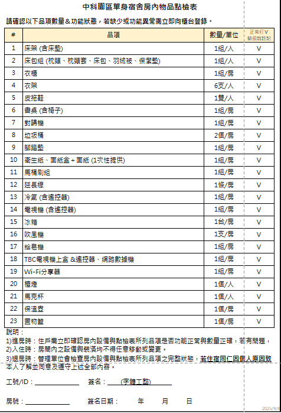
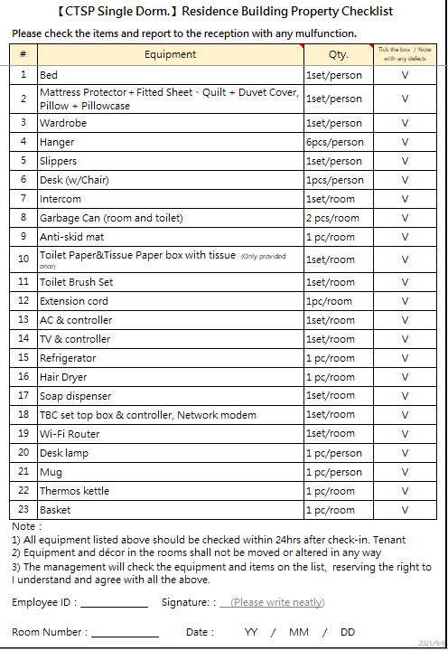
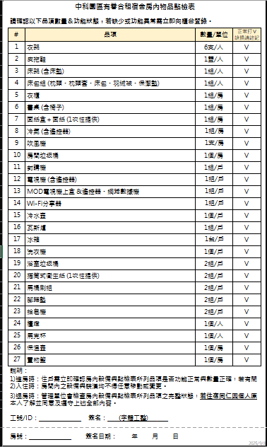
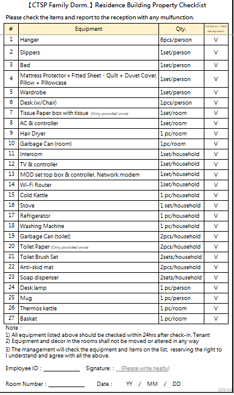
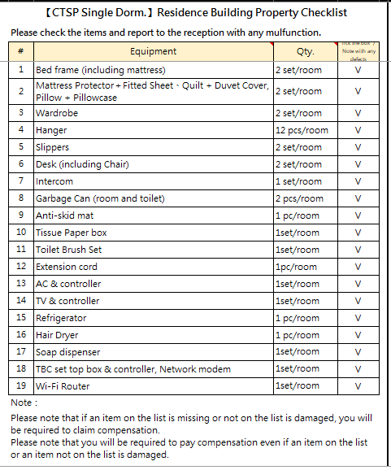

## 【R0044】點檢作業功能（宿舍管理後台／清潔派工系統／宿舍管家系統）

### 一、需求說明

1. 本需求旨在建立宿舍點檢作業之數位化流程，提供線上 check-In/Check-Out 點檢表填寫與查詢功能，作為獨立表單作業，不需與訂退房系統強制綁定。
2. 系統須提供不同角色使用之點檢表單，區分「員工（住戶）」與「櫃檯／駐廠人員」兩種表單格式與專業程度。未來也可能新增其他種類點檢表。
3. 點檢表須依據以下維度進行差異化設計：
    i. 員工職級（如一般員工、VIP等）
    ii. 訂房路徑：
        - 一般訂房（國內）：因公住宿，提供完整寢具及日用備品，無須自備。
        - 一般訂房（國外）：因公住宿，除標準備品外，另提供額外生活用品，以利外籍員工快速安頓。
        - 單身訂房：不提供寢具（棉被、枕頭），由住戶自行準備，屬長期租用性質。
        - 有眷訂房：不提供寢具（棉被、枕頭），由住戶自行準備，屬長期租用性質。
    iii. 廠別（如美國廠、中科等）
    iv. 宿舍別（不同宿舍有不同點檢表）
    v. 系統須支援上述維度之組合條件對應，例如：美國廠的VIP職級，用一般訂房路徑入住中科A宿舍，應能對應至正確的點檢表。
4. 點檢過程中若發現設備異常或損壞，使用者可於表單中直接勾選異常項目，系統須自動導入後續報修流程（詳見【R0050】報修作業功能）。
5. 當員工完成退房後，系統須自動建立點檢待辦事項（To-Do），並可指派相關人員進行現場檢查。
6. 點檢通過的流程：
    i. 台積電員工退房後會由櫃檯人員「執行點檢」，點檢完畢後，才會執行「派工清潔」
    ii. 清潔人員收到「派工清潔」指示，進房間進行清潔打掃，打掃完回報「清潔完成」
    iii. 至下一次台積電員工要入住時，櫃檯人員進房「執行點檢」，點檢完畢後，這間房間會變成準備好的狀態，可供台積電員工入住
7. 點檢不通過的流程：
    i. 現況若項目點檢不通過，均走報修單。
        - 舉例：床包未配備→建立報修單→通知櫃檯人員補發，或由台積電員工（住戶）至櫃檯領取
        - 舉例：對講機故障→建立報修單

<table>
  <tr>
    <td align="center">員工點檢表（一般／中文） </td>
    <td align="center">員工點檢表（一般／英文） </td>
  </tr>
  <tr>
    <td align="center">員工點檢表（有眷／中文） </td>
    <td align="center">員工點檢表（有眷／英文） </td>
  </tr>
  <tr>
    <td align="center">TUD退房內物品點檢表（英文） </td>
    <td></td>
  </tr>
</table>

### 二、使用情境

1. 櫃檯／駐廠人員：於住戶「入住前」及「退房後」，攜帶手機或平板至宿舍現場執行專業點檢，確認房間狀態與設備損壞責任。
    i. 退房後點檢之主要目的為確認有無設備損壞。
    ii. 接收到下一個排房資訊後，執行入住前點檢，重複上述作業流程。
2. 台積電員工（住戶）：於「入住後」透過系統自行點檢確認房內設備狀況，並於「退房前」再次執行自主點檢，以完成交屋確認。
3. 管理員（後台稽核）：於宿舍管理後台檢視員工提交之點檢結果，統整損壞狀況並進行後續處理。
4. 台積電員工（住戶）：於點檢過程中發現設備異常，提出報修申請→櫃檯人員接收並判定委派廠商→櫃檯人員追蹤維修進度與費用歸屬→維修完成→台積電員工（住戶）收到報修完成通知（詳見【R0050】報修作業功能）。

### 三、功能需求

1. 點檢表單管理
    i. 系統須提供 In/Out 點檢表之建立、填寫與查詢功能。
    ii. 系統須支援不同角色之點檢表單顯示差異（員工版／櫃檯版）。
    iii. 系統須支援依員工職級、訂房路徑、廠別及宿舍別等多維度條件，自動對應適用之點檢表單。
2. 異常與報修處理
    i. 使用者於點檢表中勾選異常項目後，系統須可建立對應報修紀錄。
    ii. 系統須支援後續維修流程串接，如報修單建立與狀態追蹤（詳見【R0050】報修作業功能）。
3. 點檢待辦機制
    i. 員工完成退房後，系統須自動產生點檢待辦事項。
    ii. 系統須支援待辦事項指派及狀態管理（未處理／處理中／完成）。
4. 多系統整合
    i. 宿舍管家系統：提供員工自主點檢填寫功能。
    ii. 清潔派工系統：提供櫃檯／駐廠人員現場點檢操作。
    iii. 宿舍管理後台：提供點檢結果查詢、稽核與管理功能。

### 四、非功能需求

1. 系統須支援行動裝置（手機、平板）操作，確保現場點檢作業順暢。
2. 點檢資料須完整保存，並具備查詢與追溯能力。
3. 系統須確保不同角色僅可存取對應權限之點檢資料。

### 五、驗收條件

1. AC-01：當台積電員工（住戶）已登入宿舍管家系統並進入點檢功能頁面，填寫完整點檢表單後按下送出，系統須成功儲存該筆點檢紀錄並顯示送出成功訊息。
2. AC-02：當櫃檯人員或駐廠人員以行動裝置（手機或平板）登入清潔派工系統，選擇指定房間並執行現場點檢，系統須正確載入對應點檢表單並支援逐項填寫與送出。
3. AC-03：當不同維度條件（員工職級、訂房路徑、廠別、宿舍別）之組合輸入後，系統須自動對應並顯示正確的點檢表單，不同組合不得出現錯誤對應。
4. AC-04：當使用者於點檢表中勾選一項以上異常項目並送出，系統須自動建立對應之報修紀錄，並可於報修清單中查詢該筆紀錄。
5. AC-05：當台積電員工（住戶）完成退房作業後，系統須自動產生一筆點檢待辦事項，並顯示於待辦清單中，狀態為「未處理」。
6. AC-06：當管理員登入宿舍管理後台，進入點檢查詢功能，系統須可依條件篩選並顯示點檢結果與對應待辦事項。
7. AC-07：當櫃檯人員尚未接收到排房資訊時，系統不得開放該房間之入住前點檢功能；接收排房資訊後，系統須開放並允許執行入住前點檢。
8. AC-08：當點檢項目未通過時，系統須引導使用者建立報修單，且報修紀錄須與該點檢紀錄關聯。

### 六、待釐清項目

（無）
