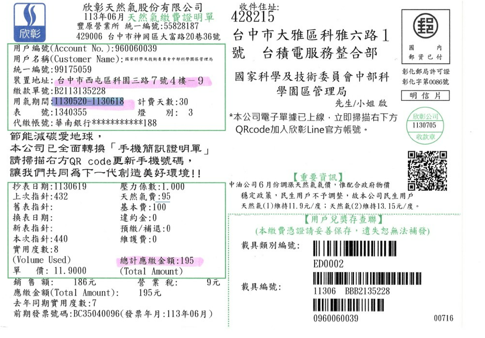
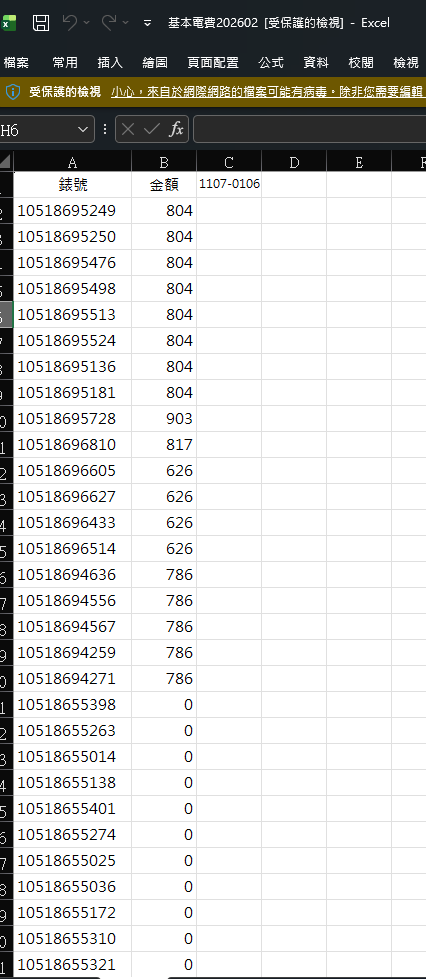
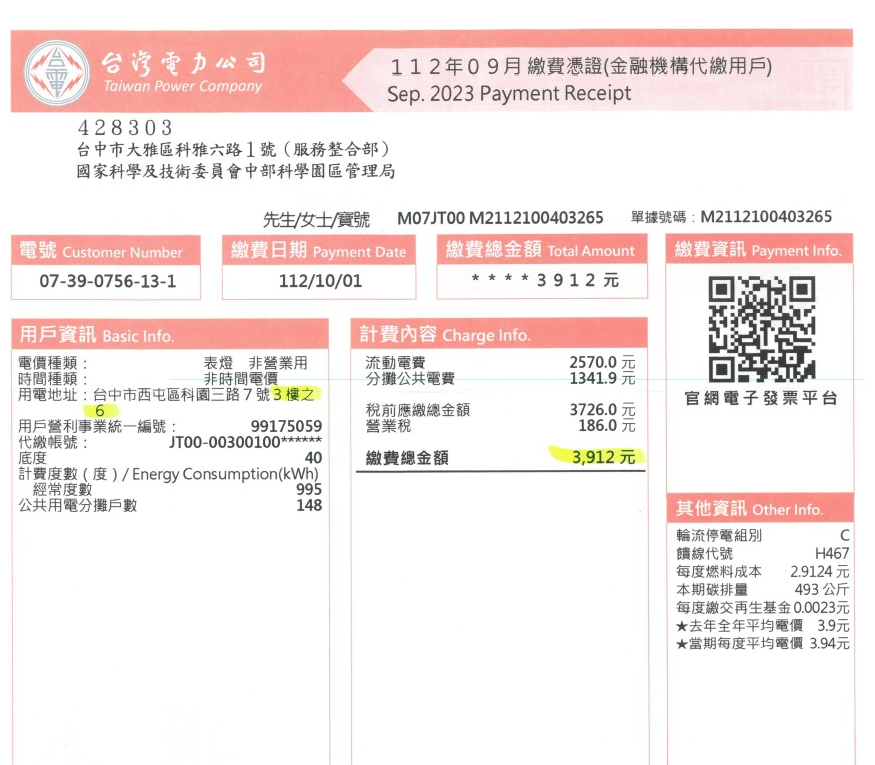

# 【R0051】扣款參數維護（宿舍管理後台）

## 一、需求說明

宿舍管理後台須提供扣款參數之維護功能，供承辦人員於執行每月扣款作業前，建立並管理各項費用之基礎資料、計費方式與分攤邏輯。本需求涵蓋扣款項目類別之定義、房間帳單參數之建立，以及各項費用之分攤規則設定。實際扣款金額之計算邏輯，詳見【R0052】扣款項目計算。

1. **扣款項目類別**

    本系統支援之扣款項目類別如下（項目類別尚需與各區域承辦人員確認）：

    i. **月租金**：單身宿舍與有眷宿舍均適用。每間房間設定不同之月租金金額，以日為計費單位，依據住戶之實際住宿期間計算費用。
    ii. **保證金**：僅適用於有眷自費住宿，單身自費住宿無保證金。每間房間設定不同之保證金金額。同一房間若有兩張床位，保證金依實際使用床位數按比例收取。
        - 兩人入住時，每人收取房間保證金之半額（例如：房間保證金為 6,000 元，每人收取 3,000 元）。
        - 若為主管房或住戶申請單人使用整間房間，則收取全額保證金。
        - 入住之第一個月收取全額保證金；退房後之次月退還全額保證金。
        - 範例：住戶於 6 月入住，6 月收取保證金全額；7 月期間退房，則於 9 月退還保證金。
        - 上述保證金收取比例規則同樣適用於月租金之計算。
    iii. **水費**：依據每間房間對應之水錶錶號，於單月或雙月收到帳單時，依住戶之住宿期間及房間住宿人數，進行錶號費用之分攤計算。
    iv. **電費**：依據每間房間對應之電錶錶號，於單月或雙月收到帳單時，依住戶之住宿期間及房間住宿人數，進行錶號費用之分攤計算。
    v. **瓦斯費**：依據每間房間對應之瓦斯錶錶號，於單月或雙月收到帳單時，依住戶之住宿期間及房間住宿人數，進行錶號費用之分攤計算。
    vi. **電話費**：依據房間綁定之市內電話號碼，於帳單到達時，比對住宿期間內之住戶資料進行費用分攤。帳單可依「電話號碼 + 費用金額」或「工號 + 費用金額」兩種格式對應，帳單資料之匯入與計算流程詳見【R0052】扣款項目計算。
        - 以電話號碼對應時，系統依住宿天數比例分攤費用至對應住戶。
        - 以工號對應時，系統將費用全額歸屬該住戶。
    vii. **設備費**：如電視、冰箱、冷氣等設備之租金，每間房間設定一筆固定金額，以日為計費單位。
        - 範例：住戶於某月實際入住 501 號房共 10 天，設備費月租 600 元，則該月設備費 =（10 ÷ 30）× 600 = 200 元。
    viii. **停車費**：適用於嘉義宿舍。車位數量有限，以抽籤方式分配。
        - 車位設定每月租金，以日為計費單位。
        - 車位使用期間與住宿期間不一定一致，住戶可能於入住一段時間後方獲分配車位。
        - 排房人員或櫃檯人員均可執行車位分配作業。
    ix. **其他費用**：其他未歸類之費用項目。

2. **帳單參數**

    i. 須建立每間房間對應之水錶錶號、電錶錶號與瓦斯錶錶號。
    ii. 須設定各項費用之分攤邏輯，例如：瓦斯費之基本費由公司與住戶共同負擔，天然氣使用費由住戶全額負擔。
    iii. 統一設定帳單拆分規則：基本費（公司 + 住戶分攤）、流動費（住戶全額負擔）。

**附件：帳單格式參考**（帳單匯入功能詳見【R0052】扣款項目計算）

- 瓦斯費帳單

    

- 電費帳單

    | 電費匯入資料格式（現行 Excel 格式） | 台電繳費憑證 |
    |:---:|:---:|
    |  |  |

## 二、使用情境

1. **建立扣款項目與分攤方式**：承辦人員進入宿舍管理後台，定義扣款項目類別（如月租金、水費、電費、瓦斯費、設備費等），並設定各項目之計費方式。例如，將設備費設定為「依個人（固定金額）」每月 600 元，而電費設定為「依房間（依帳單分攤）」。
2. **維護房間帳單參數**：承辦人員為每間房間建立對應之水錶錶號、電錶錶號與瓦斯錶錶號，確保帳單到達時可正確對應至房間。
3. **設定費用拆分邏輯**：承辦人員設定各帳單費用之拆分規則，例如電費之「基本費」由公司與住戶共同負擔，「流動電費（使用費）」由住戶全額負擔。
4. **維護車位參數**：排房人員或櫃檯人員設定車位之每月租金，並將車位分配給住戶。
5. **調整參數設定**：當費率變動或房間設備異動時，承辦人員進入系統更新對應之參數資料。

## 三、功能需求

> ⚠️ 待 SA 確認後補完。以下為依業務脈絡初步整理之功能需求草稿，須經確認後定版。

1. **扣款項目類別管理**
    i. 系統須提供扣款項目類別之新增、修改、停用功能，項目類別包含：月租金、保證金、水費、電費、瓦斯費、電話費、設備費、停車費及其他費用。
    ii. 系統須支援為每項扣款項目設定計費方式（如：固定金額、依帳單分攤）。
    iii. 系統須支援為每項扣款項目設定計費單位（如：以日計費、以月計費）。
2. **房間參數維護**
    i. 系統須支援為每間房間設定月租金金額。
    ii. 系統須支援為每間房間設定保證金金額。
    iii. 系統須支援為每間房間建立對應之水錶錶號、電錶錶號與瓦斯錶錶號。
    iv. 系統須支援為每間房間設定設備費金額。
    v. 系統須支援為每間房間綁定市內電話號碼。
3. **費用分攤規則設定**
    i. 系統須支援為水費、電費、瓦斯費設定帳單拆分規則，區分「基本費」與「流動費（使用費）」之分攤對象（公司負擔或住戶負擔）。
    ii. 系統須支援設定保證金之收取與退還規則。
4. **車位參數維護**
    i. 系統須支援車位之每月租金設定，以日為計費單位。
    ii. 系統須支援將車位分配給住戶，且車位使用期間可獨立於住宿期間設定。
    iii. 系統須支援排房人員與櫃檯人員均可執行車位分配作業。

## 四、非功能需求

> ⚠️ 待 SA 確認後補完。

（暫無）

## 五、驗收條件

> ⚠️ 待 SA 補完三、四後，PM 後補驗收條件。

（暫無）

## 六、待釐清項目

1. 扣款項目類別之完整清單，須與各區域承辦人員確認是否有遺漏或調整。
2. 保證金之收取規則：當同房間兩位住戶之入住與退房時間不同步時，保證金金額如何調整（例如：原兩人入住各收 3,000 元，其中一人退房後，另一人之保證金是否需調整為 6,000 元）。
3. 停車費之車位分配流程確認：目前規劃為「住戶自行於系統點選申請 → 依先來後到排隊 → 先到先得」，此流程是否正確？另外，住戶排隊取得車位後，系統詢問是否確定保留該車位，確認保留後是否還有後續流程（如簽約、押金繳納等）？
4. 三、功能需求及四、非功能需求待 SA 確認後定版；五、驗收條件待 PM 補完。
